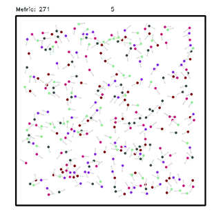
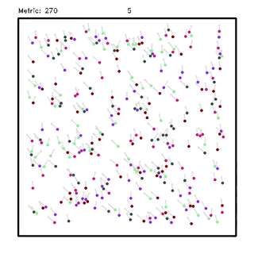
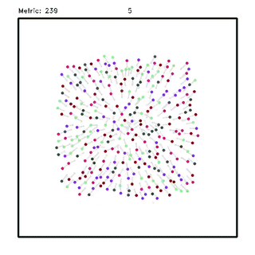

# Flocking-Segregative Swarming Behaviors using Gibbs Random Fields

Implementation of a decentralized coordination of autonomous swarms using Gibbs Random Field and Metropolis-Hastings sampling toward heterogeneous swarm segregation.

## Dependecies

-   [ROS Melodic](http://wiki.ros.org/melodic/Installation)

## Installation

-   Using git (or download the zip file) clone this repository into the "source code" folder of your ROS workspace (e.g. ~/catkin_ws/src ).

```sh
$ cd ~/catkin_ws/src
$ git clone https://github.com/verlab/2021-icra-grf-swarm.git
```

## Usage

- How to run the algorithm proposed in this work?

```sh
$ roslaunch grf_swarm grf_swarm.launch # or grf_swarm_nav.launch to more informations
```
<p align="center">
  
</p>


- We contrast our stochastic approach with a gradient-type showing that it easy get trapped into local minima.

```sh
$ roslaunch grad_swarm grad_swarm.launch
```
<p align="center">
  
</p>

- Approach proposed by Inacio et al. 2019.

```
Inácio, F. R., Macharet, D. G., & Chaimowicz, L. (2019). PSO-based strategy for the segregation of heterogeneous robotic swarms. Journal of Computational Science, 31, 86-94.
```

```sh
$ roslaunch pso_swarm pso_swarm.launch
```
<p align="center">
  
</p>


- Approach proposed by Mitrano et al. 2019.

```
Mitrano, P., Burklund, J., Giancola, M., & Pinciroli, C. (2019, August). A minimalistic approach to segregation in robot swarms. In 2019 International Symposium on Multi-Robot and Multi-Agent Systems (MRS) (pp. 105-111). IEEE.
```

```sh
$ roslaunch min_swarm min_swarm.launch
```
<p align="center">
  
</p>


- Approach proposed by Santos et al. 2020. 
This approach uses global knowlegde about the position of the robots and then we use as a baseline approach.

```
Santos, V. G., Pires, A. G., Alitappeh, R. J., Rezeck, P. A., Pimenta, L. C., Macharet, D. G., & Chaimowicz, L. (2020). Spatial segregative behaviors in robotic swarms using differential potentials. Swarm Intelligence, 1-26.
```

```sh
$ roslaunch vgs_swarm vgs_swarm.launch
```
<p align="center">
  
</p>
